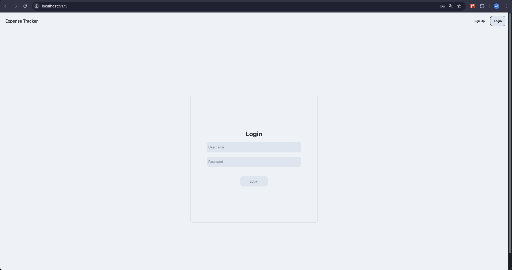
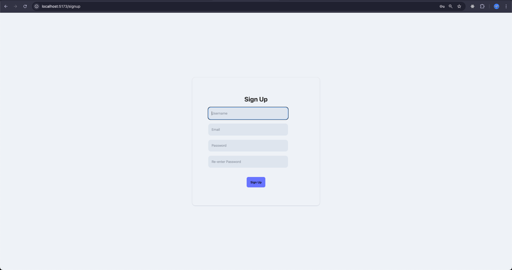
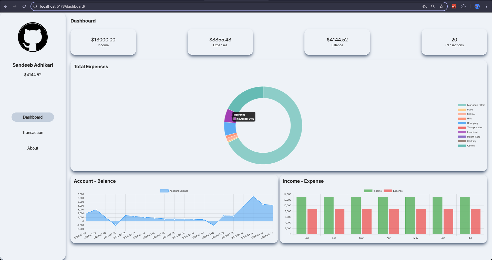
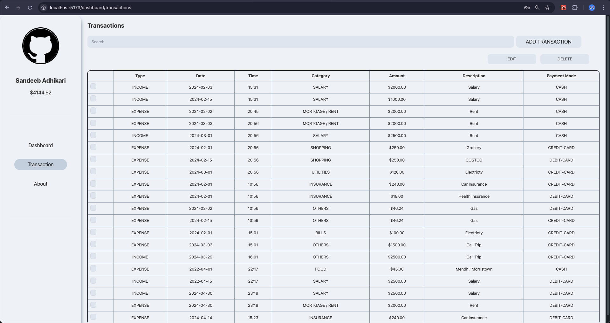
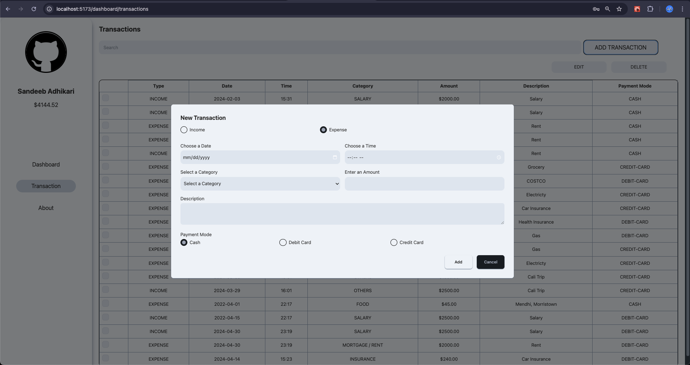
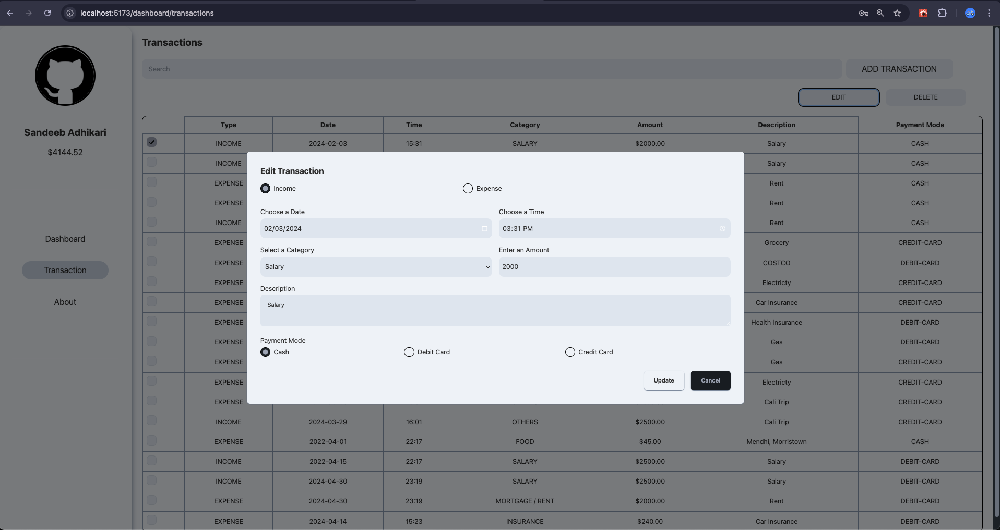
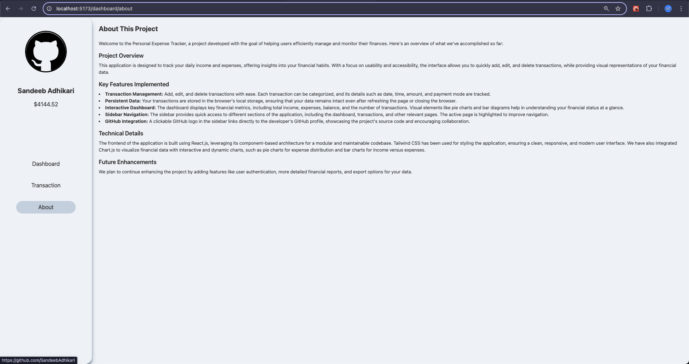

# Professional Expense Tracker

The Professional Expense Tracker is a web application designed to help users track and manage their professional expenses efficiently. It features the ability to categorize expenses, generate reports, and visualize spending patterns. The app is built with a focus on usability, ensuring users can manage their finances with ease.

## Features

- **Expense Management**: Add, edit, and delete expenses.
- **Category Management**: Organize expenses into customizable categories.
- **Detailed Reports**: Generate reports based on date range, categories, etc.
- **Data Visualization**: Visualize spending patterns with charts and graphs.
- **Local Storage**: Stores data locally for offline use.
- **Responsive Design**: Optimized for mobile and desktop devices.

## Technologies Used

- **Frontend**: React, Tailwind CSS, DaisyUI
- **Data Visualization**: Chart.js
- **Deployment**: Vercel

## Installation

1. Clone the repository:

   ```bash
   git clone https://github.com/SandeebAdhikari/Personal_Expense_Tracker.git
   ```

2. Navigate to the project directory:

   ```bash
   cd professional-expense-tracker
   ```

3. Install the dependencies:

   ```bash
   npm install
   ```

4. Start the application:

   ```bash
   npm run dev
   ```

   The application will run on `http://localhost:5173`.

## Usage

- Add your expenses through the user-friendly interface.
- Organize your expenses into different categories for better tracking.
- Generate and view detailed reports to analyze your spending habits.
- Utilize the data visualization features to get a clear overview of your expenses.

## Screenshots

### Login



### SignUp



### DashBoard



### Transaction



### Add Transaction



### Edit Transaction



### About



## Contributing

1. Fork the repository.
2. Create a new branch (`git checkout -b feature-branch`).
3. Make your changes.
4. Commit your changes (`git commit -m 'Add some feature'`).
5. Push to the branch (`git push origin feature-branch`).
6. Open a Pull Request.

## License

This project is licensed under the MIT License.
